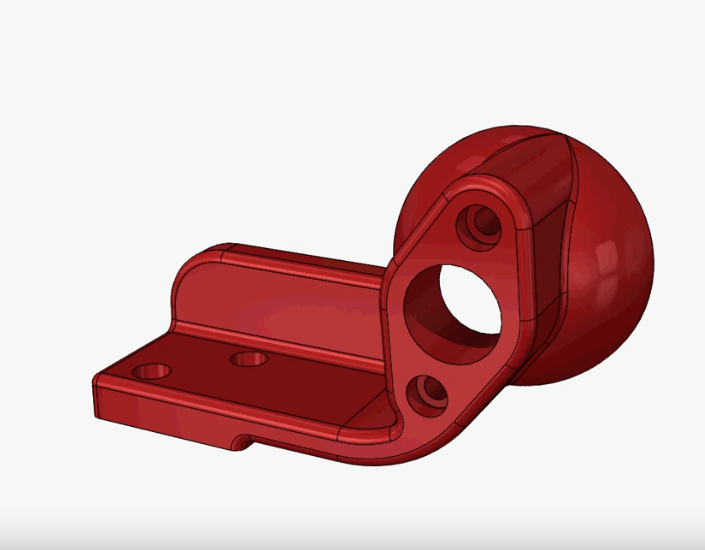
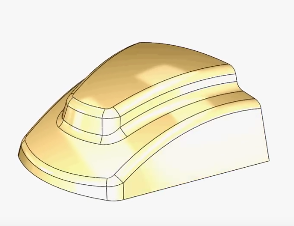
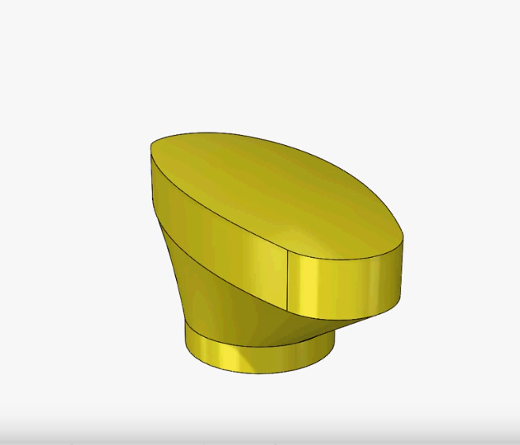
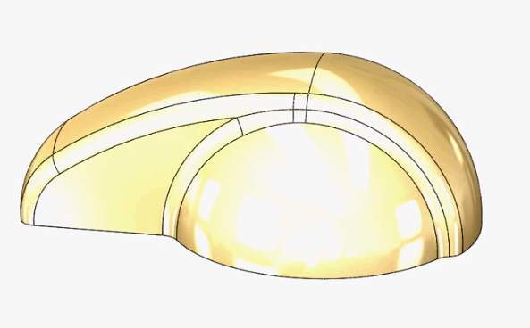
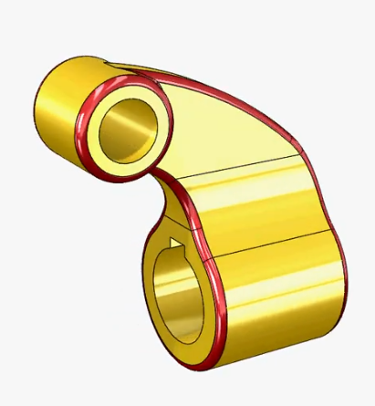
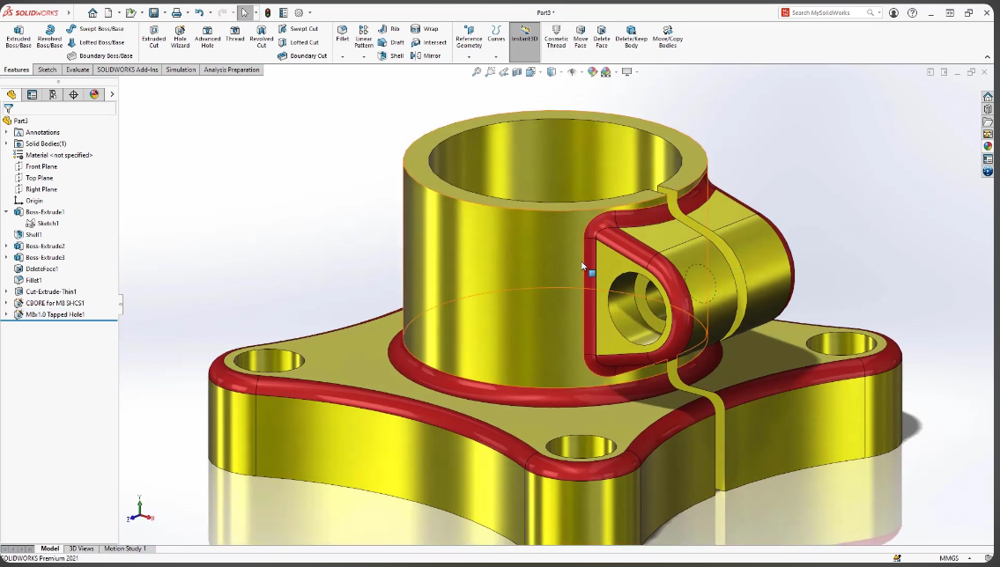
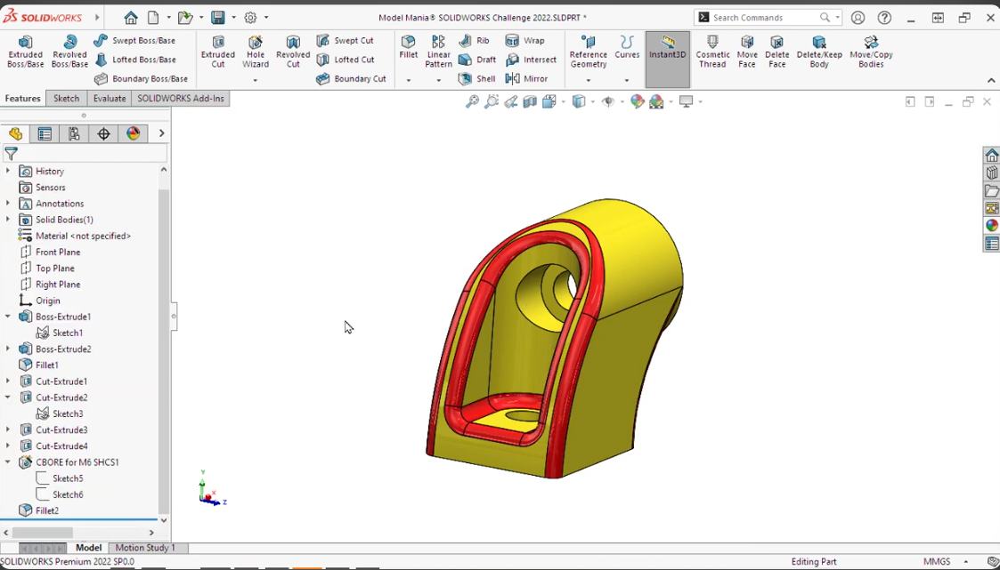
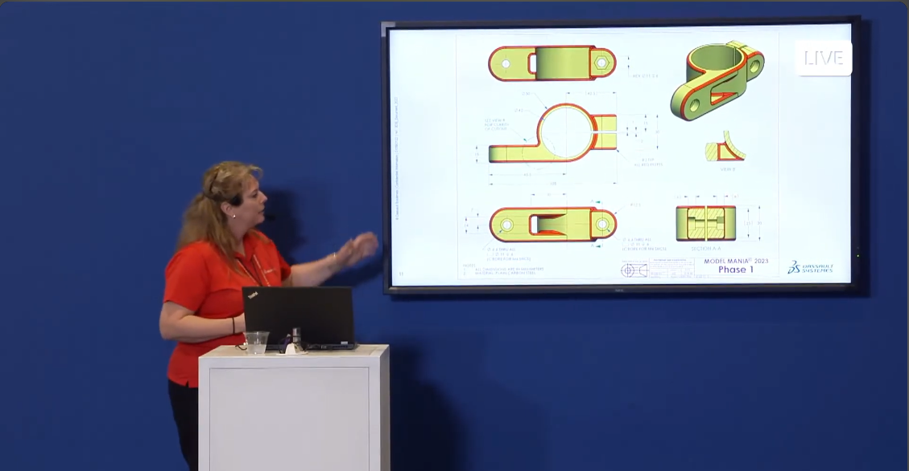
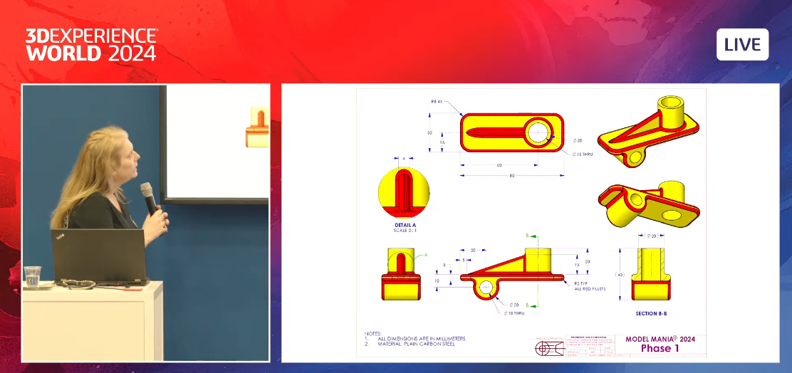
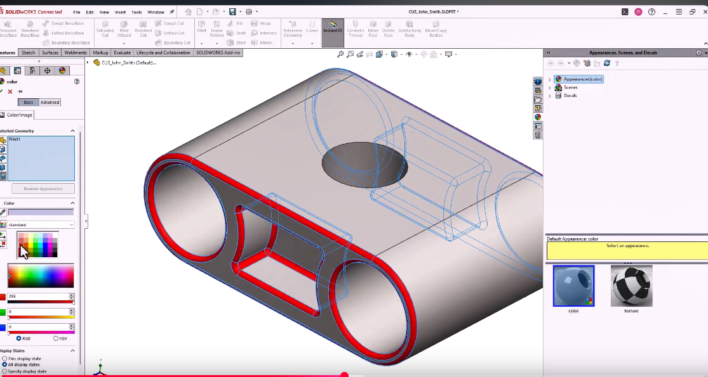

# MYSELF construct Parts

## DIN35 RAILS Adapter

This part is sourced from a Taobao listing, which provides only a sketch.

[Taobao Store - Item No. 25#B](https://item.taobao.com/item.htm?id=527291720986)

Using the sketch image, I reconstructed the 3D model.

[Model](DIN35_RAILS_Adapter/DIN35_Adapter.FCStd)

## Model Mania 2000

This section is sourced from the SolidWorks blog - [Solidworks 26 years of model mania](https://blogs.solidworks.com/tech/2025/02/26-years-of-model-mania.html)

[Solidworks Solutions - Youtube  video](https://youtu.be/JUZwYKomkXU)

and I also watched [FreeCAD Newbie's](https://youtu.be/PEqGOdvllFc) YouTube video to help me recreate the model.

The folder [**Mania2000**](Mania2001) contains:

- [FreeCAD model](Mania2000/Mania2000.FCStd)
- [FreeCAD Phase 2 model](Mania2000/Mania2000-S2.FCStd) - Phase 2 without fillet, because currently, FreeCAD 1.0.2 can't support it.
- [Mania 2000 Phase 1](Mania2000/Model-Mania-2000-Stage-1.png)
- [Mania 2000 Phase 2](Mania2000/Model-Mania-2000-Stage-2.png)

## Model Mania 2001

This part is sourced from the SolidWorks blog - [Solidworks 26 years of model mania](https://blogs.solidworks.com/tech/2025/02/26-years-of-model-mania.html)

[Solidworks Solutions - Youtube  video](https://youtu.be/vbI9UImoXME)

The folder [**Mania2001**](Mania2001) contains:

- [FreeCAD model](Mania2001/Mania2001.FCStd)
- [FreeCAD new model](Mania2001/Mania2001-NEW.FCStd) - corrected version
- [FreeCAD Phase 2 model](Mania2001/Mania2001-S2.FCStd) - base on the corrected version
- [Mania 2001 Phase 1](Mania2001/Model-Mania-2001-Phase-1.jpg)
- [Mania 2001 Phase 2](Mania2001/Model-Mania-2001-Phase-2.jpg)

## Model Mania 2002

This part is sourced from the SolidWorks blog - [Solidworks 26 years of model mania](https://blogs.solidworks.com/tech/2025/02/26-years-of-model-mania.html)

[Solidworks Solutions - Youtube  video](https://youtu.be/p4aZb8AkZT8)

and I also watched [FreeCAD Newbie's](https://youtu.be/RkRgAb87RGU) and [Katt Kushol's কাঠ কুশল](https://youtu.be/RLc-R-nLT48) YouTube video to help me recreate the model.

The folder [**Mania2002**](Mania2002) contains:

- [FreeCAD model](Mania2002/Mania2002.FCStd)
- [FreeCAD Phase 2 model - 1](Mania2002/Mania2002-S2-1.FCStd)
- [Mania 2002 Phase 1](Mania2002/Model-Mania-2002-Phase-1.jpg)
- [Mania 2002 Phase 2](Mania2002/Model-Mania-2002-Phase-2.jpg)

## Model Mania 2003

This part is sourced from the SolidWorks blog - [Solidworks 26 years of model mania](https://blogs.solidworks.com/tech/2025/02/26-years-of-model-mania.html)

[Solidworks Solutions - Youtube  video](https://youtu.be/ynUMiKGIJ_4)

The folder [**Mania2003**](Mania2003) contains:

- [FreeCAD model](Mania2003/Mania2003.FCStd)
- [Mania 2003 Phase 1](Mania2003/Model-Mania-2003-Phase-1.jpg)
- [Mania 2003 Phase 2](Mania2003/Model-Mania-2003-Phase-2.jpg)

## Model Mania 2004

This part is sourced from the SolidWorks blog - [Solidworks 26 years of model mania](https://blogs.solidworks.com/tech/2025/02/26-years-of-model-mania.html)

[Solidworks Solutions - Youtube  video](https://youtu.be/gS_SIhvUdnw)

The folder [**Mania2004**](Mania2004) contains:

- [FreeCAD model](Mania2004/Mania2004.FCStd)
- [Mania 2004 Phase 1](Mania2004/Model-Mania-2004-Phase-1.jpg)
- [Mania 2004 Phase 2](Mania2004/Model-Mania-2004-Phase-2.jpg)

## Model Mania 2005

This part is sourced from the SolidWorks blog - [Solidworks 26 years of model mania](https://blogs.solidworks.com/tech/2025/02/26-years-of-model-mania.html)

[Solidworks Solutions - Youtube  video](https://youtu.be/OKgWcBTxD5I)

The folder [**Mania2005**](Mania2005) contains:

- [FreeCAD model](Mania2005/Mania2005.FCStd)
- [Mania 2005 Phase 1](Mania2005/Model-Mania-2005-Phase-1.jpg)
- [Mania 2005 Phase 2](Mania2005/Model-Mania-2005-Phase-2.jpg)

## Model Mania 2006

This part is sourced from the SolidWorks blog - [Solidworks 26 years of model mania](https://blogs.solidworks.com/tech/2025/02/26-years-of-model-mania.html)

[Solidworks Solutions - Youtube  video](https://youtu.be/xJGzpIb4jBM)

and I also watched [FreeCAD Newbie's](https://youtu.be/uK--IU85sOY) YouTube video to help me recreate the correct model.

The folder [**Mania2006**](Mania2006) contains:

- [FreeCAD model - first try](Mania2006/Mania2006.FCStd)
- [FreeCAD model - corrected ](Mania2006/Mania2006-New.FCStd) - reference FreeCAD Newbie's youtube video to re-construct correct version
- [FreeCAD model - Phase 2 with VarSet ](Mania2006/Mania2006-S2.FCStd) - implement a variable 'Slope' for change Phase 1 & Phase 2, some steps need re-work when change variable
- [Mania 2006 Phase 1](Mania2006/Model-Mania-2006-Phase-12.jpg)
- [Mania 2006 Phase 2](Mania2006/Model-Mania-2006-Phase-22.jpg)

## Model Mania 2007

This part is sourced from the SolidWorks blog - [Solidworks 26 years of model mania](https://blogs.solidworks.com/tech/2025/02/26-years-of-model-mania.html)

[Solidworks Solutions - Youtube  video](https://youtu.be/DGHHejPmjIs)

The folder [**Mania2007**](Mania2007) contains:

- [FreeCAD model](Mania2007/Mania2007.FCStd)
- [Mania 2007 Phase 1](Mania2007/Model-Mania-2007-Phase-1.jpg)
- [Mania 2007 Phase 2](Mania2007/Model-Mania-2007-Phase-2.jpg)

## Model Mania 2021

This part is sourced from the SolidWorks blog - [Solidworks 26 years of model mania](https://blogs.solidworks.com/tech/2025/02/26-years-of-model-mania.html)

[Solidworks Solutions - Youtube  video](https://youtu.be/qWKEk5rGo-4)

The folder [**Mania2021**](Mania2021) contains:

- [FreeCAD model](Mania2021/Mania2021.FCStd)
- [Mania 2021](<Mania2021/Model-Mania-2021.jpg>)

## Model Mania 2022

This part is sourced from the SolidWorks blog - [Solidworks 26 years of model mania](https://blogs.solidworks.com/tech/2025/02/26-years-of-model-mania.html)

[Solidworks Solutions - Youtube  video](https://youtu.be/2nJeZwyj4b0)

The folder [**Mania2022**](Mania2022) contains:

- [FreeCAD model](Mania2022/Mania2022.FCStd)
- [Mania 2022](<Mania2022/Model-Mania®-2022-FINAL.jpg>)

## Model Mania 2023

This part is sourced from the SolidWorks blog - [Solidworks 26 years of model mania](https://blogs.solidworks.com/tech/2025/02/26-years-of-model-mania.html)

[Solidworks Solutions - Youtube  video](https://youtu.be/1-0WZAooSt8?t=16863)

The folder [**Mania2023**](Mania2023) contains:

- [FreeCAD model](Mania2023/Mania2023.FCStd)
- [Mania 2023 Phase 1 & 2 PDF format](<Mania2023/Model-Mania_-In-person-2023.pdf>)

## Model Mania 2024

This part is sourced from the SolidWorks blog - [Solidworks 26 years of model mania](https://blogs.solidworks.com/tech/2025/02/26-years-of-model-mania.html)

[Solidworks Solutions - Youtube  video](https://youtu.be/kMMrqlKi_zk)

The folder [**Mania2024**](Mania2024) contains:

- [FreeCAD model - Phase 1](Mania2024/Mania2024.FCStd)
- [Mania 2024 Phase 1 & 2 PDF](<Mania2024/Model-Mania®-2024.pdf>)

## Model Mania 2025

This part is sourced from the SolidWorks blog - [Solidworks 26 years of model mania](https://blogs.solidworks.com/tech/2025/02/26-years-of-model-mania.html)

[Solidworks Solutions - Youtube  video](https://youtu.be/kMMrqlKi_zk)

The folder [**Mania2025**](Mania2025) contains:

- [FreeCAD model - Phase 1](Mania2025/Mania2025.FCStd)
- [FreeCAD model - Phase 2](Mania2025/Mania2025-S2.FCStd), not complete, due to fillet feature not work on all edge
- [Mania 2025 Phase 1](Mania2025/MM25-P1-1.pdf)
- [Mania 2025 Phase 2](Mania2025/MM25-P2.pdf)
