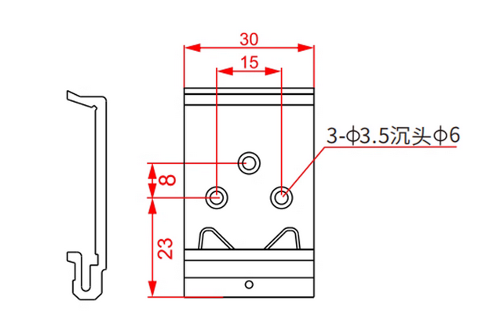
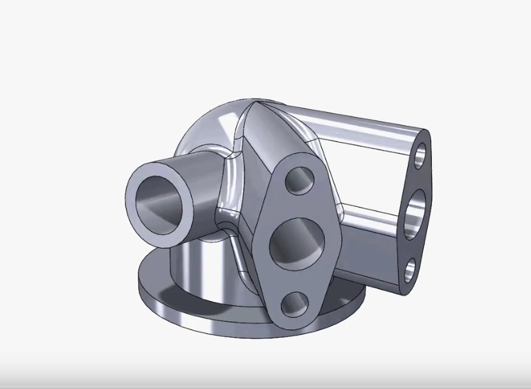
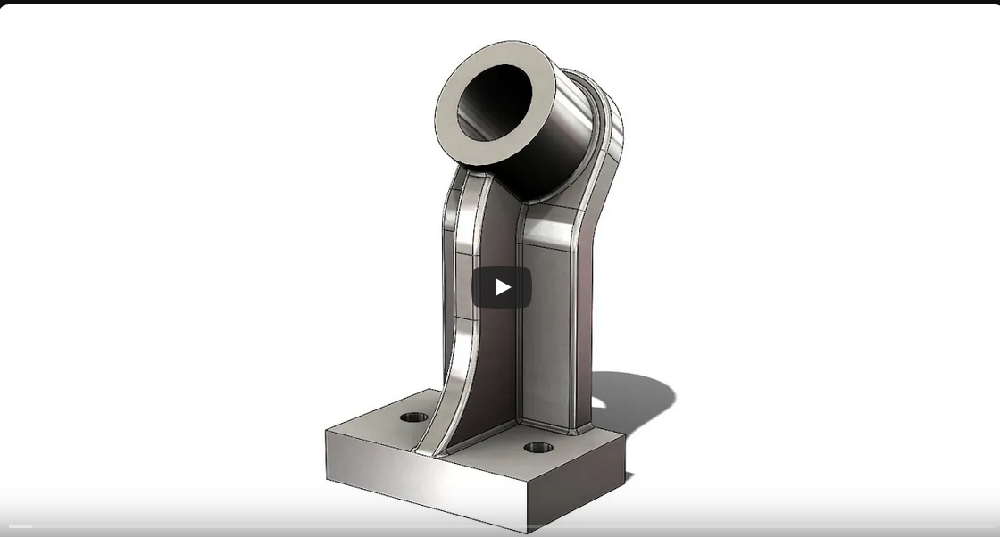
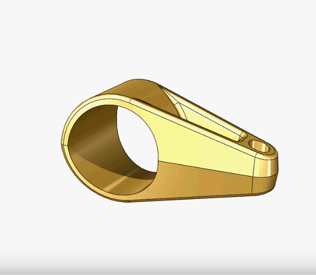

# MYSELF construct Parts

## DIN35 RAILS Adapter

This part is sourced from a Taobao listing, which provides only a sketch.

[Taobao Store - Item No. 25#B](https://item.taobao.com/item.htm?id=527291720986)

Using the sketch image, I reconstructed the 3D model.

[Model](DIN35_RAILS_Adapter/DIN35_Adapter.FCStd)

## Model Mania 2000

This section is sourced from the SolidWorks blog - [Solidworks 26 years of model maina](https://blogs.solidworks.com/tech/2025/02/26-years-of-model-mania.html)

[Solidworks Solutions - Youtube  video](https://youtu.be/JUZwYKomkXU)

and I also watched [FreeCAD Newbie's](https://youtu.be/PEqGOdvllFc) YouTube video to help me recreate the model.

The folder [**Mania2000**](Mania2001) contains:

- [FreeCAD model](Mania2000/Mania2000.FCStd)
- [FreeCAD Phase 2 model](Mania2000/Mania2000-S2.FCStd) - Phase 2 without fillet, because currently, FreeCAD 1.0.2 can't support it.
- [Mania 2000 Phase 1](Mania2000/Model-Mania-2000-Stage-1.png)
- [Mania 2000 Phase 2](Mania2000/Model-Mania-2000-Stage-2.png)

## Model Mania 2001

This part is sourced from the SolidWorks blog - [Solidworks 26 years of model maina](https://blogs.solidworks.com/tech/2025/02/26-years-of-model-mania.html)

[Solidworks Solutions - Youtube  video](https://youtu.be/vbI9UImoXME)

The folder [**Mania2001**](Mania2001) contains:

- [FreeCAD model](Mania2001/Mania2001.FCStd)
- [FreeCAD new model](Mania2001/Mania2001-NEW.FCStd) - corrected version
- [FreeCAD Phase 2 model](Mania2001/Mania2001-S2.FCStd) - base on the corrected version
- [Mania 2001 Phase 1](Mania2001/Model-Mania-2001-Phase-1.jpg)
- [Mania 2001 Phase 2](Mania2001/Model-Mania-2001-Phase-2.jpg)

## Model Mania 2002

This part is sourced from the SolidWorks blog - [Solidworks 26 years of model maina](https://blogs.solidworks.com/tech/2025/02/26-years-of-model-mania.html)

[Solidworks Solutions - Youtube  video](https://youtu.be/p4aZb8AkZT8)

and I also watched [FreeCAD Newbie's](https://youtu.be/RkRgAb87RGU) and [Katt Kushol's কাঠ কুশল](https://youtu.be/RLc-R-nLT48) YouTube video to help me recreate the model.

The folder [**Mania2002**](Mania2002) contains:

- [FreeCAD model](Mania2001/Mania2002.FCStd)
- [Mania 2002 Phase 1](Mania2002/Model-Mania-2002-Phase-1.jpg)
- [Mania 2002 Phase 2](Mania2002/Model-Mania-2002-Phase-2.jpg)
