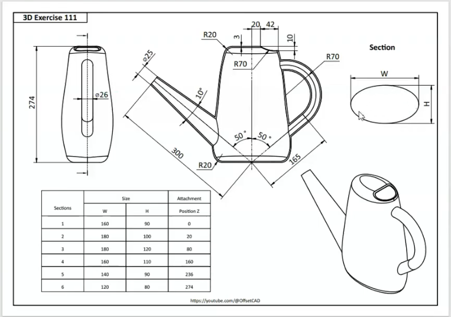
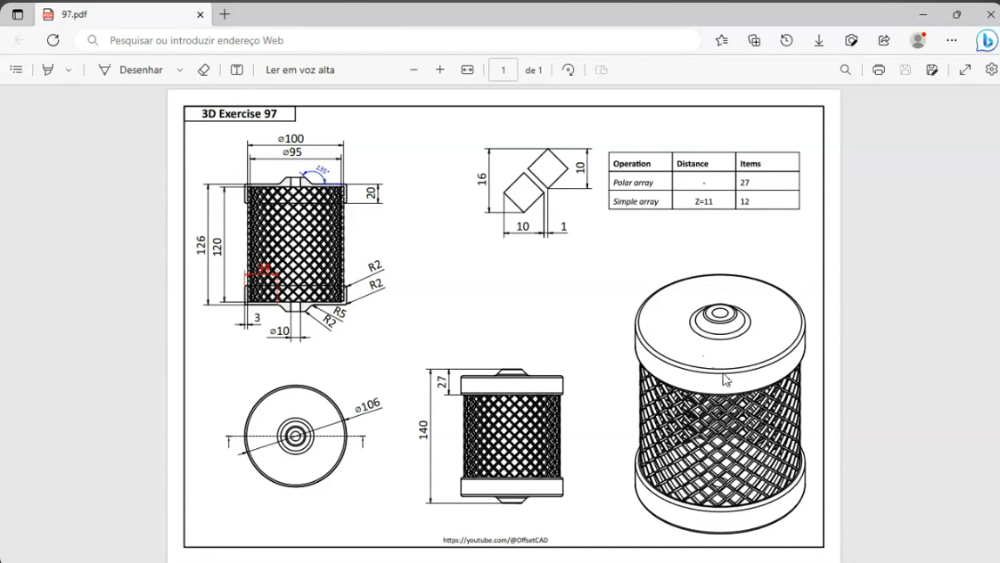

# OffsetCAD Tutorials

This folder collection contains my exclusive files following OffsetCAD's YouTube videos, for making files and studying how to use FreeCAD.

## RuggedBox

  [Youtube link](https://youtu.be/Q4zB2eqgLHo)

  

  The folder [**RuggedBox**](RuggedBox) contains:

  - [Parts model](RuggedBox/Beginner.FCStd) - create all parts model
  - [Assembly parts](RuggedBox/AssemblyBox.FCStd) - final assembly

## Protection Mesh Frame

  [Youtube link](https://youtu.be/XHLgFfNG1vM)

  

  The folder [**ProtectionMeshFrame**](ProtectionMeshFrame) contains:

  - [ProtectionMeshFrame](ProtectionMeshFrame/ProtectionMeshFrame.FCStd)

## Pitcher

  [Youtube link](https://youtu.be/eHu2oZY9HDg)

  

  The folder [**Pitcher**](Pitcher) contains:

  - [Pitcher Model](<Pitcher/Exercise 111 - Pitcher.FCStd>) - Modify version

## SplitClamp

  [Youtube link](https://youtu.be/BXhYOSUCVq0)

  

  The folder [**SplitClamp**](SplitClamp) contains:

  - [Split Model](<SplitClamp/SplitClamp.FCStd>) - Modify version

## Bucket

  [Youtube link](https://youtu.be/HUJ2NoHGsNU)

  

  The folder [**Bucket**](Bucket) contains:

  - [Incorrect Model by myself](Bucket/Bucket.FCStd)

  - [use video method to create mesh](Bucket/Bucket_NEW.FCStd) - but some parameters not same

  - [Diff. Mesh](Bucket/Bucket_A1.FCStd) - another parameters version
